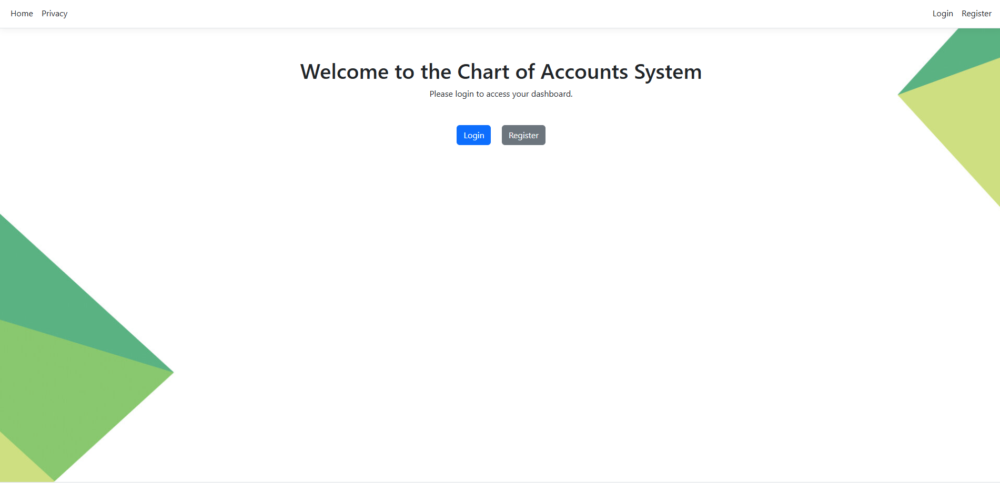
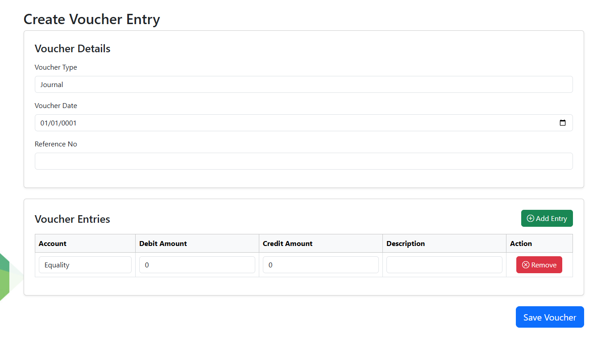
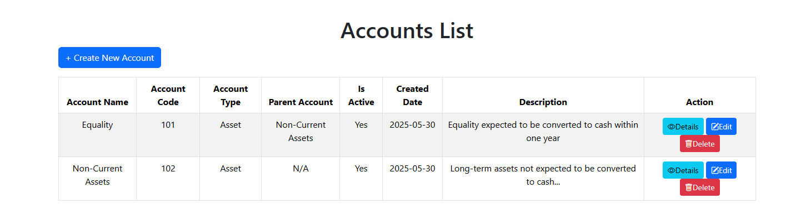
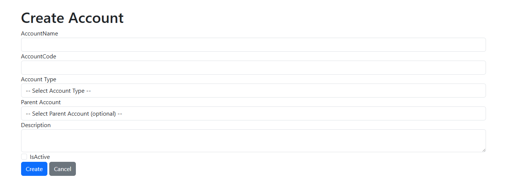
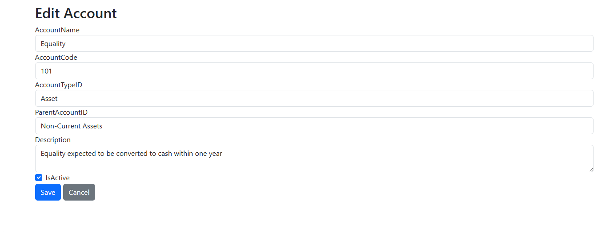
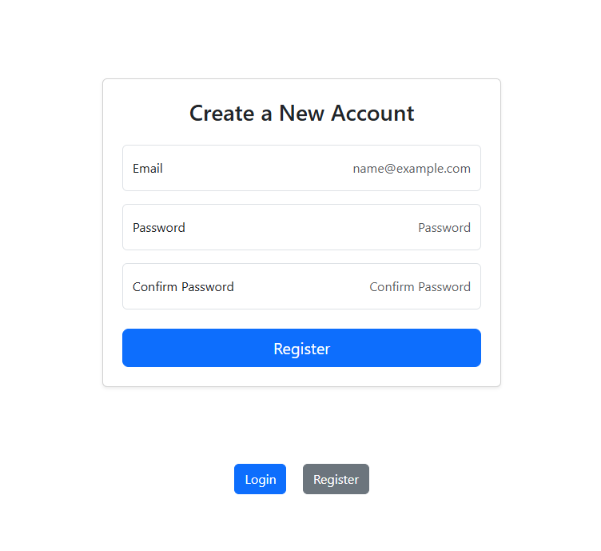
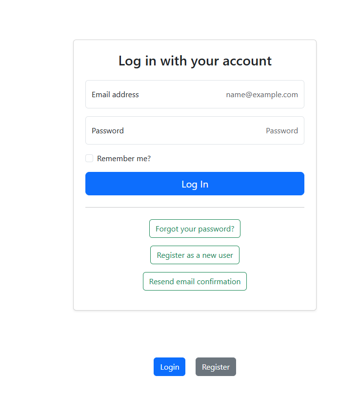

# 🧾 Mini Account Management System

This is a simple **Account Management System** built using **ASP.NET Core Razor Pages** with **Identity** for user authentication. The system is designed to manage user registration, login, and secure access control. 

🔐 Authentication Workflow
ASP.NET Core Identity is set up under the /Areas/Identity/ folder.

Default Identity UI is scaffolded and customized.

The _LoginPartial.cshtml is included in the main layout to display login/register links or user info after login.

👥 Login Flow
Click Register from the navigation bar.

Register a new account with email and password.

Login using the credentials.

After login, your username and Logout option will appear in the header.

You can add role-based navigation and access restrictions in the next phases.

## 📌 Features

- ✅ List all accounts (hierarchically or flat)
- ➕ Create a new account
- ❌ Delete an existing account
- 🛡️ Secure authentication with ASP.NET Core Identity
- 📦 SQL Server backend using stored procedures
- 🎯 Follows clean separation of concerns and uses `ViewModel` binding
- Role-based Authentication (Admin, Accountant, Viewer)
- Chart of Accounts with Parent/Child Hierarchy
- Voucher Entries: Journal, Payment, Receipt
- Stored Procedure 
- ASP.NET Identity with custom role handling
- Clean Razor Pages UI

## ⚙️ Technologies Used
- ASP.NET Core Razor Pages
- MS SQL Server (with stored procedures)
- Bootstrap (for UI)
- Identity (customized roles)

## 📸 Chart of Accounts Screenshot
### 🧾 Chart of Accounts

### 🧾 Voucher Entry Page

### 🧾 Account List

### 🧾 Create Account Page

### 🧾 Edit Account 

### 🧾 Registration

### 🧾 LogIn

  
## 🧪 How to Run
1. Clone the repo
2. Set up the database and run stored procedures and add some data to Account Type for DropDown.
3. Update the connection string in `appsettings.json`
4. Run the project

